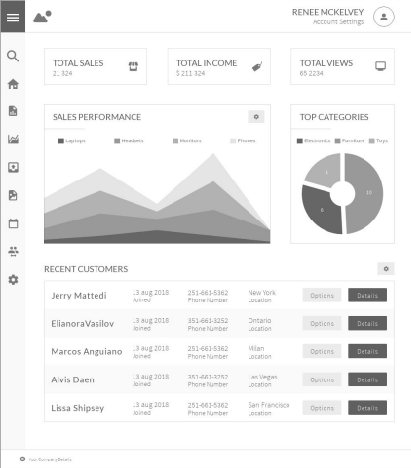
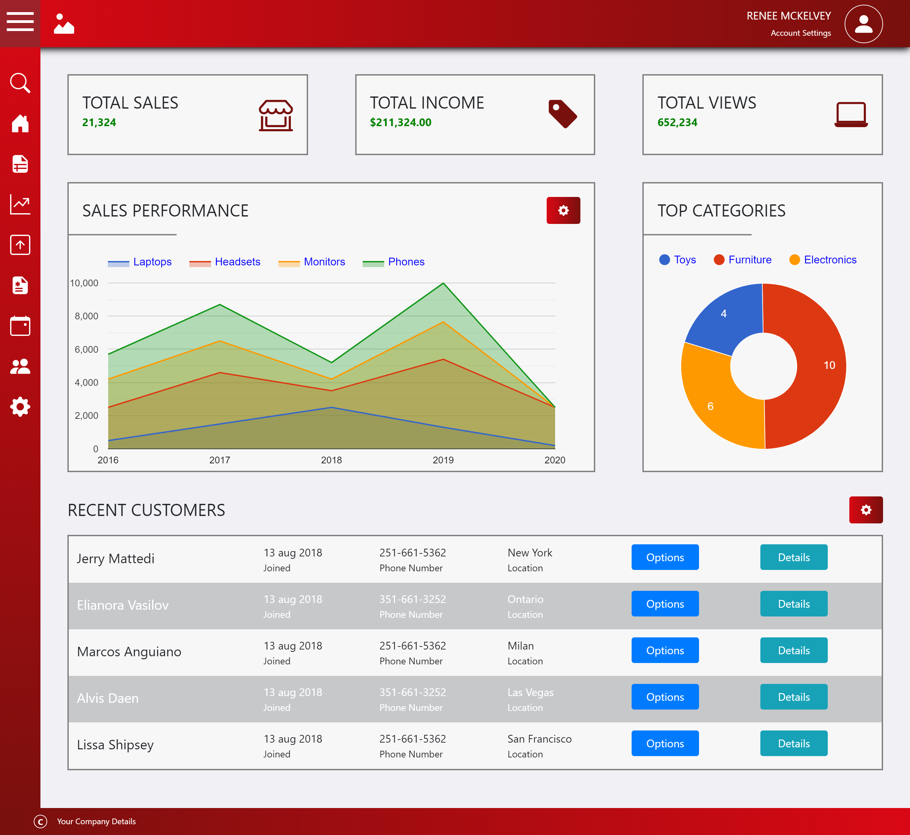

<p align="center">
  
</p>

<h1 align="center">ESIG challenge</h1>

## O que era para ser feito? 🤔

O desafio era desenvolver o wireframe a baixo usando
HTML5, CSS e Bootstrap.<br /> <br />
<strong>Prazo: 1 semana<strong>

<div align="center">
  <br>
    
  <br>
</div>

## [Site](https://esig-challenge.vercel.app/) 💻 

Página web mostrando o desafio concluido

<div align="center">
  <br>
    
  <br>
</div>

## Tecnologias usadas 📚
- HTML5
- CSS3
- Bootstrap
- JavaScript

## Desenvolvimento 🎬

Clonando o repositório:

```
git clone https://github.com/DanielSoaresRocha/ESIG-challenge.git
```

Navegando até a pasta do repositório:

```
cd Esig/src
```

Baixando as dependências

```
npm i
```

Rodando o projeto

- Abra o arquivo `index.html` no seu navegador

## License 📝

This project is licensed under the [MIT License](https://opensource.org/licenses/MIT) - see the [LICENSE](LICENSE) file for details.

## Autor

<table>
  <tr>
    <td align="center"><a href="https://github.com/DanielSoaresRocha"><br /><sub><b>Daniel Soares</b></sub></a><br /><a href="https://github.com/DanielSoaresRocha/ESIG-challenge/commits?author=DanielSoaresRocha" title="Code">💻</a></td>
  <tr>
</table>


